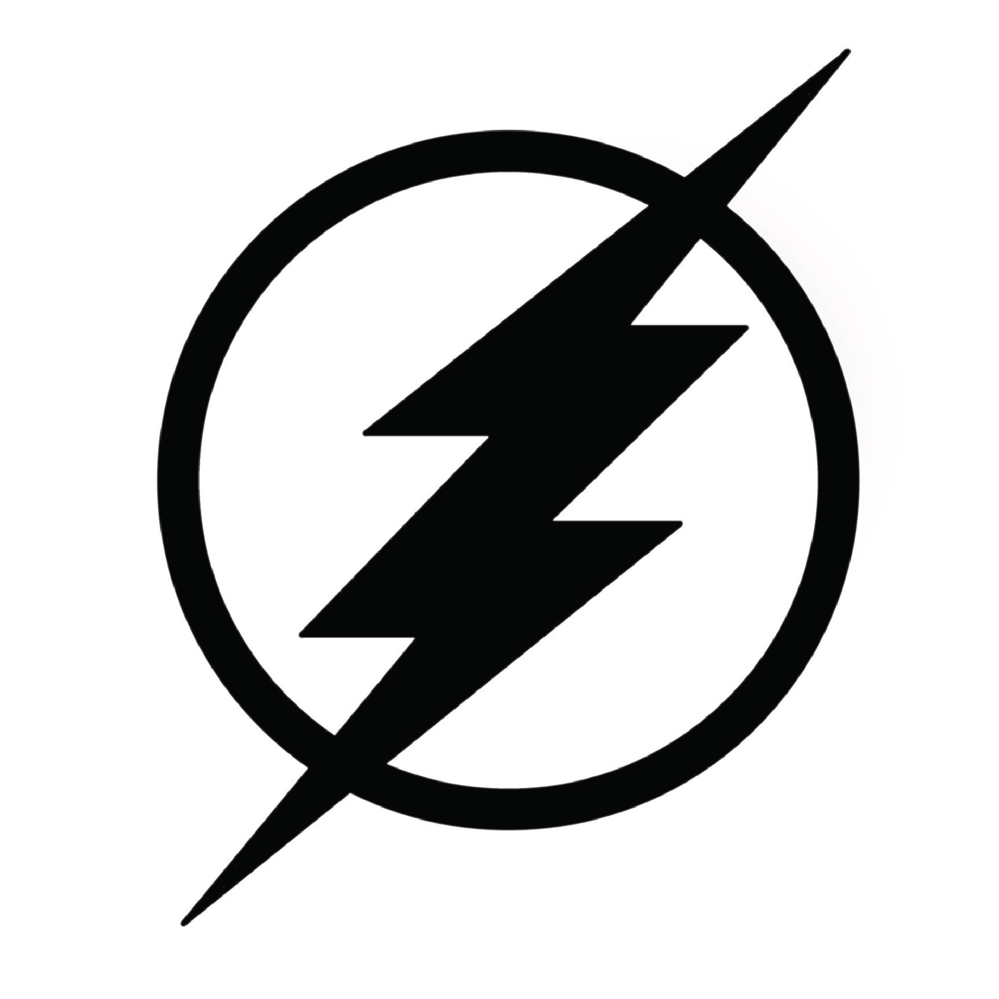

# DiscordBot-Flash

[](http://ForTheBadge.com)
[](https://forthebadge.com)
[](https://forthebadge.com)

<!-- PROJECT LOGO -->
<br />
<p align="center">
<p align="center">
  <a href="https://github.com/GizmolabAI/DiscordBot-Flash">
    
  </a>

<h3 align="center">FLASH</h3>
  <p align="center">
   A multipurpose Discord with a Web Dashboard
    <br />
    <a href="https://docs.gizmolab.xyz"><strong>Explore The Docs »</strong></a>
    <br />
    <br />
     <a href="https://flash.gizmolab.xyz/" target="_blank">View Demo</a>
    ·
    <a href="https://github.com/GizmolabAI/DiscordBot-Flash/issues">Report Bug</a>
    ·
    <a href="https://github.com/GizmolabAI/DiscordBot-Flash/issues">Request Feature</a>
  </p>
</p>


<!-- TABLE OF CONTENTS -->
<details open="open">
  <summary>Table of Contents</summary>
  <ol>
    <li>
      <a href="#about-the-project">About The Project</a>
      <ul>
        <li><a href="#built-with">Built With</a></li>
      </ul>
    </li>
    <li>
      <a href="#getting-started">Getting Started</a>
      <ul>
        <li><a href="#installation">Installation</a></li>
      </ul>
    </li>
    <li><a href="#usage">Usage</a></li>
    <li><a href="#roadmap">Roadmap</a></li>
    <li><a href="#contributing">Contributing</a></li>
    <li><a href="#license">License</a></li>
    <li><a href="#contact">Contact</a></li>
    
  </ol>
</details>


<!-- ABOUT THE PROJECT -->
## About The Project

A Multipurpose Discord Bot with a Web Dashboard! With commands for Anime | Moderation | Games | Activities | Image Manipulation | Utilities and more!

### Built With
[](https://nodejs.org/en/)
[](https://www.mongodb.com/cloud/atlas/)
[](https://tailwindcss.com/)

<!-- GETTING STARTED -->
## Getting Started

- You Invite Flash to your Server by Clicking [Here](https://discord.com/api/oauth2/authorize?client_id=876092358175899698&permissions=55800753399&redirect_uri=http%3A%2F%2Flocalhost%3A3000%2Fcallback&scope=bot%20applications.commands)
- You can also Follow The Guide To launch your own instance of Flash!


### Installation

**1.** Create A Discord Bot Application on [Discord Developer Portal](https://discord.com/developers/applications) and Get Your Bot Token!

**2.** Create A [MongoDB](https://www.mongodb.com/cloud/atlas/lp/try2-in?utm_source=google&utm_campaign=gs_apac_india_search_core_brand_atlas_desktop&utm_term=mongodb%20web%20service&utm_medium=cpc_paid_search&utm_ad=e&utm_ad_campaign_id=12212624347&gclid=CjwKCAjw47eFBhA9EiwAy8kzNIxUxDVBfCKUmjLMNJ9JiWgkFauXv9LtC0cFG-qrmM-Vg5Y4RUG7IBoCHyUQAvD_BwE) Database and get its Connection Link. Checkout This Tutorial To know how to use MongoDB [Tutorial](https://youtu.be/8no3SktqagY)

**3.** Get Your free API Keys at 
* [Memer Api](https://memer-api.js.org/docs?path=welcome/welcome) - For the image commands
* [Tenor Gif](https://tenor.com/developer/keyregistration)
* [top.gg](https://top.gg/) - You only need this if you have your bot on that website!


**4.** Clone the repo
   ```sh
   git clone https://github.com/GizmolabAI/DiscordBot-Flash.git
   ```
**5.** Install NPM packages
   ```sh
   npm install
   ```
**6.** Enter your Discord Bot Token, API Key and Mongo Data base url in the config.js file.
   ```js
    "token": "YOUR BOT TOKEN",
    "prefix": "The Default Prefix for the Bot",
    "MEMER_API_TOKEN": "Memer API Token", // Get The Memer API Token from https://discord.com/invite/emD44ZJaSA
    "TENOR_API_KEY": "Tenor API Token", // Get The Tenor API Key from https://www.tenor.co/api/v1/key/
    "mongooseConnectionString": "mongodb connection url", 
    "id": "clientid",  // https://discordapp.com/developers/applications/ID/information,
    "clientSecret": "client secret",  // https://discordapp.com/developers/applications/ID/information,
    "domain": "http://localhost:3000", // Enter your domain here when you are running the bot on a different domain than localhost
    "port": 3000,
    "usingCustomDomain": false // Make this true if you want to use your own domain
   ```
**7.** Add callback URI in discord portal. eg - https://yourdomainname.com/callback <br>
If you are using local host add http://localhost:3000/callback as the redirect URI.


<!-- USAGE EXAMPLES -->
## Usage
> Invite The Bot

Invite The Bot You created at Discord Dev Portal to your Server!

> Start the Bot

Type This In the terminal after navigating to folder where you cloned the repo!

```sh
npm start
```

> Flash Offers A lot of commands to work with:

* ANIME: `ANIMESEARCH, CHARACTER , ANIME GIFS , ETC`
* FUN: `MEME , ROAST , SAY , + 5..`
* IMAGE: `byemom, abandon , cancer , changemymind, + 21.....`
* UTILITY: `avatar, covid , weather , qr code , +3...`
* ACTIVITIES: `Youtube Together, Fishing , +2...`
* MODERATION: `Kick, ban , clear messages , + 5...`
* SOUNDBOARD:`Ahshit , bruh , sheesh, + 11...`
* GAMES: `Snake , tictactoe , guessthenumber , akinator, + 4..`
* ECONOMY: `Balance , beg , work , shop , + 9..`

You can also add more commands of your choice If you understand javascript and DiscordJS. Or make Feature Requests [Here](https://github.com/GizmolabAI/DiscordBot-Flash/issues)


<!-- ROADMAP -->
## Roadmap

- Dashboard ✔
- Ported Old Commands ✔
- Event Logging 🟢
- Economy System ❌
- XP System ❌

| Symbol | Legend |
| :---: | :---: |
| ✔ | Done |
| 🟢 | In Progress |
| ❌ | Not Started |

See the [open issues](https://github.com/GizmolabAI/DiscordBot-Flash/issues) for a list of proposed features (and known issues).

<!-- SUPPORT -->
## BUY ME A COFFEE
[![Buy me a coffee][buymeacoffee-shield]][buymeacoffee]


<!-- CONTRIBUTING -->
## Contributing

Any contributions you make are **greatly appreciated**.

1. Fork the Project
2. Create your Feature Branch (`git checkout -b feature/AmazingFeature`)
3. Commit your Changes (`git commit -m 'Add some AmazingFeature'`)
4. Push to the Branch (`git push origin feature/AmazingFeature`)
5. Open a Pull Request


## CREDITS 
DASHBOARD BASE : [Yash094](https://github.com/Yash094)

<!-- LICENSE -->
## License

Distributed under the GPL-3.0 License. See `LICENSE` for more information.


<!-- CONTACT -->
## Contact
[](https://twitter.com/gizmo_gg)
[](https://discord.gg/jDP2FbvCdk) 


[buymeacoffee-shield]: https://www.buymeacoffee.com/assets/img/guidelines/download-assets-sm-1.svg
[buymeacoffee]: https://www.buymeacoffee.com/g1zmo


